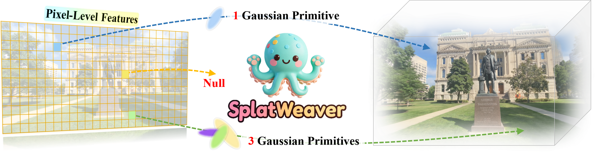
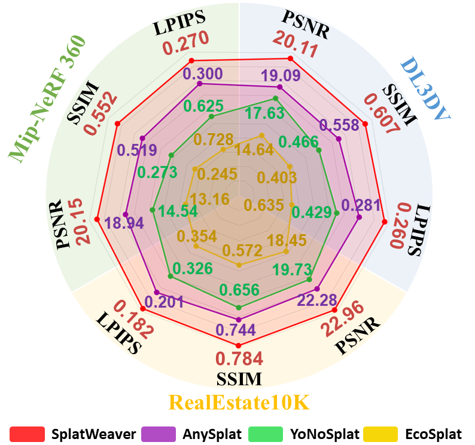

<div align="center">
<h3> :medal_military: SplatWeaver: Learning to Allocate Gaussian Primitives for Generalizable Novel View Synthesis
</h3>

<p align="center">
  <a href="https://yecongwan.github.io/SplatWeaver/">🌍 Project Page</a>
  &nbsp;|&nbsp;
  <a href="https://arxiv.org/abs/2605.07287">📖 Paper</a>
  &nbsp;|&nbsp;
  <a href="https://huggingface.co/Jeasco/SplatWeaver">🤗 Hugging Face</a>
</p>

Yecong Wan, Fan Li, Mingwen Shao, Wangmeng Zuo
</div>

  
<table>
  <tr>
    <td>  </td>
  </tr>
</table>

https://github.com/user-attachments/assets/b0752f15-c941-46ad-8996-ea80316a5482

## :bulb: Highlight
 - :heart_eyes: :heart_eyes: SplatWeaver is a feed-forward framework that adaptively allocates Gaussian primitives based on local scene complexity. By concentrating primitives in intricate regions while maintaining sparsity in smooth areas, our approach enables a more principled and flexible allocation of Gaussians within the scene, yielding superior rendering quality with fewer primitives.
<p align="center">
  
</p>


## :label: TODO 
- [x] Paper and Video Demo.
- [x] Inference Demo.
- [x] Training and Evaluation.


## Installation

1. Clone SplatWeaver.
```bash
git clone https://github.com/yecongwan/SplatWeaver.git
cd SplatWeaver
```

2. Create the environment.
```bash
conda create -y -n splatweaver python=3.10
conda activate splatweaver
pip install torch==2.2.0 torchvision==0.17.0 torchaudio==2.2.0 --index-url https://download.pytorch.org/whl/cu121
pip install -r requirements.txt
```


## Quick Start

```
# Inference with the example in the folder “examples/garden”

python demo.py
```


## Training

```
# dataset preprocessing

Please prepare data in the datasets folder. You can add any in-the-wild multi-view data with the general dataset class.


# start training:
python src/main +experiment=multi-dataset trainer.num_nodes=1
```


## Evaluation

```
# Novel View Synthesis
python src/eval_nvs.py --data_dir ... --ckpt_path ...
```


## Citation
If you find the code helpful in your research or work, please cite the following paper:
```
@article{wan2026splatweaver,
  title={SplatWeaver: Learning to Allocate Gaussian Primitives for Generalizable Novel View Synthesis},
  author={Wan, Yecong and Li, Fan and Shao, Mingwen and Zuo, Wangmeng},
  journal={arXiv preprint arXiv:2605.07287},
  year={2026}
}
```

## Acknowledgement
We thank all authors behind these repositories for their excellent work: [VGGT](https://github.com/facebookresearch/vggt), [AnySplat](https://github.com/InternRobotics/AnySplat), and [gsplat](https://github.com/nerfstudio-project/gsplat).


